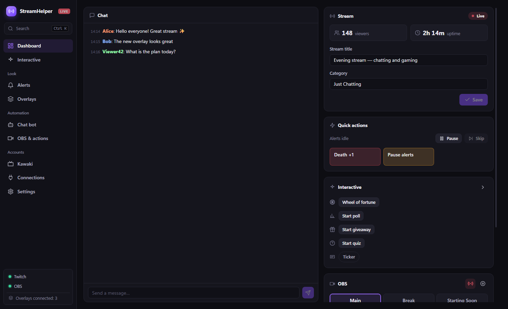
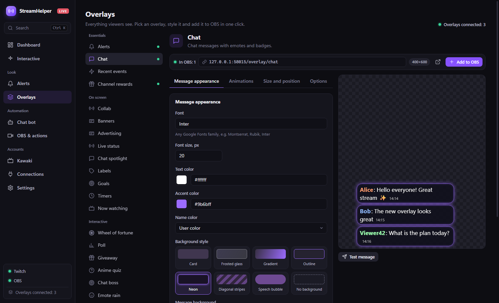
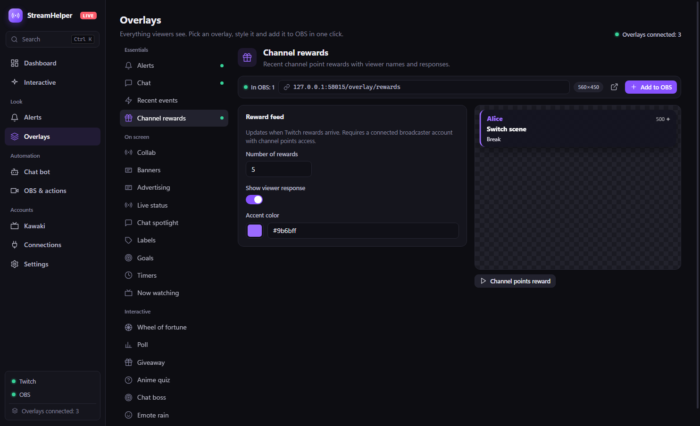

# StreamHelper — Windows releases

[Русский](README.md) · [English](README.en.md)

This repository hosts StreamHelper installers and auto-update files. StreamHelper brings Twitch stream controls, OBS, chat, alerts, interactive features, and overlays into one Windows app.

If you have access to the private [source repository](https://github.com/Rayness/StreamHelper/releases/latest), the release is available there too. This public repository serves updates without requiring users to provide a token.

## Screenshots

The screenshots use fictional demo data and contain no real accounts or tokens.

| Chat settings | Channel rewards | Collaboration |
| --- | --- | --- |
|  |  |  |

## Install

1. Open the [latest release](https://github.com/Rayness/StreamHelper-Releases/releases/latest).
2. Download `StreamHelper-Setup-<version>.exe` and run it on Windows x64.
3. In **Connections**, sign in to Twitch and optionally connect OBS.
4. In **Overlays**, click **Add to OBS** for the sources you want.

The installer is currently **not signed** with a publisher certificate. The release description and `SHA256SUMS.txt` provide a SHA-256 checksum.

Installed 0.4.x versions check for updates automatically, download them in the background, and let you choose when to restart from **Settings**. Version 0.2.0 and older must be upgraded manually once.

## Release files

- `StreamHelper-Setup-<version>.exe` — Windows x64 installer.
- `StreamHelper-Setup-<version>.exe.blockmap` and `latest.yml` — updater metadata.
- `SHA256SUMS.txt` — installer checksum.

See each release for its change list. License: [MIT](LICENSE).
