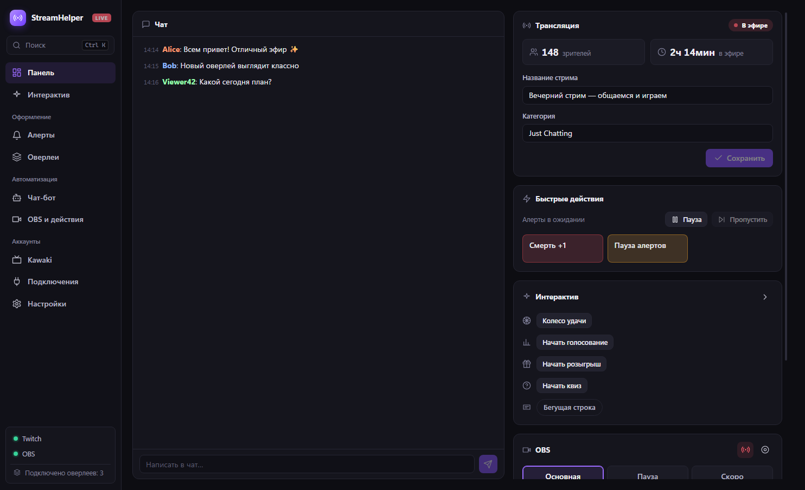
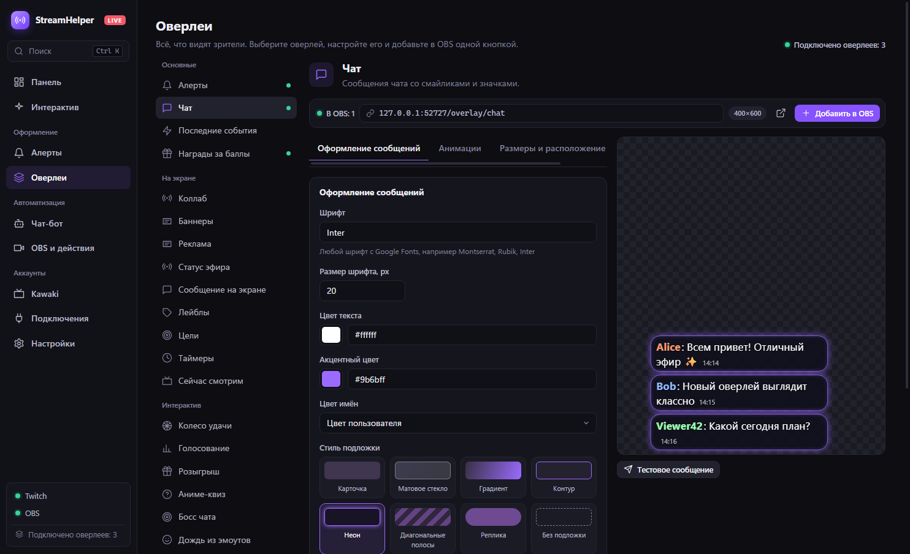
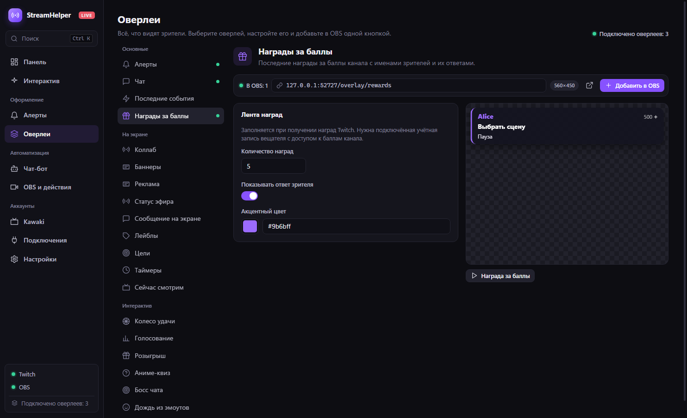
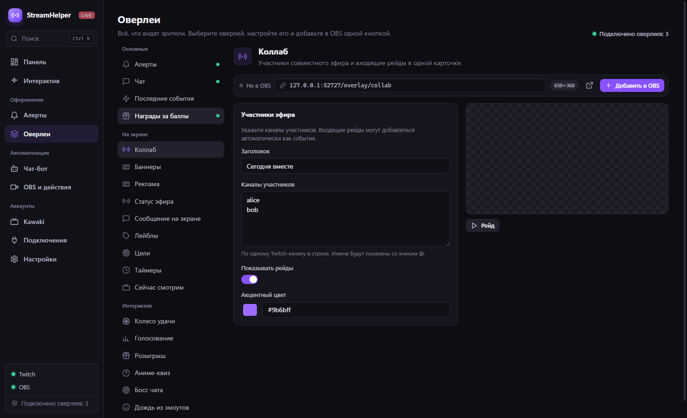

# StreamHelper — выпуски для Windows

[Русский](README.md) · [English](README.en.md)

Здесь опубликованы установщики и файлы автообновления StreamHelper. Приложение помогает управлять Twitch-стримом, OBS, чатом, алертами, интерактивом и оверлеями из одного окна.

Если у вас есть доступ к закрытому [репозиторию исходников](https://github.com/Rayness/StreamHelper/releases/latest), выпуск доступен и там. Этот публичный репозиторий нужен для автообновлений без токена.

## Скриншоты

Демонстрационные данные, без реальных аккаунтов и токенов.

| Настройка чата | Награды за баллы | Коллаб |
| --- | --- | --- |
|  |  |  |

## Установка

1. Откройте [последний выпуск](https://github.com/Rayness/StreamHelper-Releases/releases/latest).
2. Скачайте `StreamHelper-Setup-<версия>.exe` и запустите установщик на Windows.
3. В приложении откройте **Подключения**, войдите в Twitch и при необходимости подключите OBS.
4. В разделе **Оверлеи** нажмите **Добавить в OBS** у нужного источника.

Установщик пока не подписан сертификатом издателя. SHA-256 указан в описании выпуска и файле `SHA256SUMS.txt`.

Начиная с версии 0.4.x приложение само проверяет новые выпуски, загружает их в фоне и предлагает установить в **Настройках**. Перезапуск запускается вручную, чтобы не прерывать эфир. Версии 0.2.0 и старее нужно один раз обновить вручную.

## Файлы выпуска

- `StreamHelper-Setup-<версия>.exe` — установщик Windows x64.
- `StreamHelper-Setup-<версия>.exe.blockmap` и `latest.yml` — файлы обновления для установленного приложения.
- `SHA256SUMS.txt` — контрольная сумма установщика.

Список изменений находится в описании каждого выпуска. Лицензия — [MIT](LICENSE).
